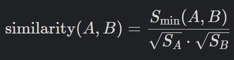
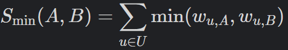
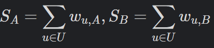

# 🌍 Explore With Me

## Идея

Свободное время — это важный ресурс, который нужно грамотно использовать. Каждый день мы составляем планы, как его провести — куда пойти и с кем встретиться.
Основная сложность заключается в поиске информации и организации встреч. Нужно учитывать множество деталей: какие мероприятия запланированы, свободны ли наши друзья, как оповестить всех участников и где провести встречу.

**Explore With Me** - это бэкенд для платформы - афиши. В этой афише можно предложить какое-либо мероприятие (например поход на концерт или сплав по реке) и собрать компанию для участия в нём.

---

## Архитектура

### 🔑 Основные микросервисы
Основная бизнес логика приложения расположена в Maven модуле `core`. И разделена на микросервисы по принципам **Domain - Driven Design**. 
Каждый микросервис отвечает за свою бизнес - область и имеет собственную базу данных **PostgreSQL**. Для работы с данными используется `Spring Data JPA`.
Взаимодействие микросервисов осуществляется по REST с помощью `Feign` клиентов. Для устойчивости приложения в случае недоступности одного или нескольких сервисов применяется `Resilience4j Circuit Breaker` с fallback - логикой.
- `event-service` — основной сервис приложения, содержит логику по управлению мероприятиями - создание, поиск с применением фильтров, редактирование события и его статуса.
Так же в этом сервисе осуществляется управление категориями мероприятий и подборками мероприятий.
- `request-service` — обработка заявок пользователей на участие в мероприятии. Поддерживает три режима:
    - автоматическое принятие (без модерации),
    - ручное рассмотрение автором мероприятия,
    - участие без ограничения (open event).  
      Учитывает лимиты участников и состояние заявки (ожидание, одобрено, отклонено).
- `subscription-service` — сервис подписок. Управление подписками пользователей на других пользователей. Также формирует ленту мероприятий от любимых авторов.
- `user-service` — управление аккаунтами пользователей.
- `interaction` — содержит компоненты, необходимые для взаимодействия между сервисами, а также общие компоненты:
  - `Feign` клиенты для межсервисного взаимодействия,
  - DTO классы
  - конфигурационные классы
  - кастомные исключения
  - глобальный `@ControllerAdvice`.

### ⚙️ Инфраструктурные компоненты
Компоненты инфрастуктуры расположены в модуле `infra` и включают микросервисы:
- `discovery-server` — сервер регистрации и обнаружения сервисов на базе `Spring Cloud Eureka`.
  Все микросервисы при старте регистрируются в Eureka с динамическими именами и сетевыми адресами. 
Последующие вызовы между сервисами (FeignClient, RestTemplate) выполняются по имени сервиса, вместо жёстко заданного URL.
- `config-server` — сервер конфигурации на базе `Spring Cloud Config Server`. Централизованное хранение и доставка конфигураций сервисов.
- `gateway-server` — API-шлюз для маршрутизации запросов, `Spring Cloud Gateway`.

### Рекомендательная система
В основе рекомендательной системы лежит **Item - based** подход. Система опирается на сходство мероприятий.
Если пользователю нравится определенное мероприятие, то ему будут предложены подобные мероприятия.
Для вычисления сходства используется **косинусный коэффициент** (коэффициент Отиаи). 

<details><summary>Формула</summary>
Косинусное сходство между двумя мероприятиями A и B рассчитывается формуле:

 \
Числитель — это сумма минимальных весов для двух мероприятий А и B.

 \
Знаменатель — произведение квадратных корней от общих сумм весов для каждого мероприятия:



В качестве весов для мероприятия используются следующие значения:
* 0,4 - если пользователь просмотрел мероприятие
* 0,8 - если пользователь подал заявку на участие в мероприятии
* 1 - если пользователь участвовал в мероприятии и поставил лайк после его завершения
</details>

Рекомендательная система располагается в Maven модуле `stats` и состоит из следующих микросервисов:
* `collector` - принимает данные о действиях пользователей по gRPC и передаёт её в Kafka топик в формате **Avro**.
* `aggregator` - читает из топика Kafka информацию о действиях пользователей. На основе этого пересчитывает сходства мероприятий и отправляет в другой топик Kafka.
* `analyzer` - сохраняет в базе данных информацию о действиях пользователей с мероприятиями и коэффициенты сходства мероприятий.
Генерирует рекомендации и предоставляет их по gRPC. Реализует следующие методы:
    * Предоставление рекомендаций на основе истории взаимодействий пользователя и схожести мероприятий
    * Предоставление похожих мероприятий на данное
    * Предоставление рейтинга мероприятия
* `serialization` - содержит _avro_ и _proto_ схемы, классы сгенерированные на их основе. И также avro сериализаторы и десериализаторы.
* `stats-client` - легковесная библиотека, содержащая gRPC клиенты для сервисов _collector_ и _analyzer_.
Клиенты так же используют circuit breaker и fallback методы для устойчивости приложения, в случае недоступности сервисов рекомендательной системы.
Импортируется как зависимость в сервисы core.

---

[OpenAPI спецификация](docs/ewm-main-service-spec.json) для внешнего API.

---

## 🚀 Запуск приложения

### Требования
- Apache Maven
- Docker

### Запуск
```bash
mvnw clean install -DskipTests
docker-compose up --build -d
```